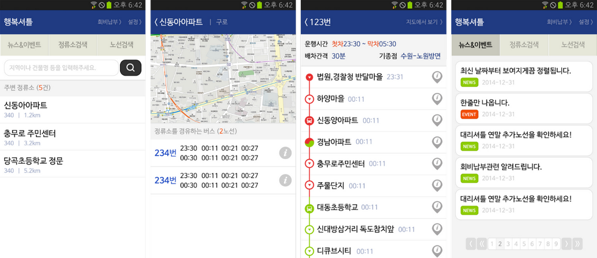

# 연락처
- koreaparks@gmail.com 

# 경력기술서

## TouchFlow
블루투스기반 모바일 to PC 컨트롤
- 기간: 2020.02 ~ 
- 소속: 개인
- 발주처: Flowithus
- 역할: Android, iOS, PC(Winform, WPF) 개발
- 사용기술: Kotlin, Swift, C#, Firebase Cloud Engine, Firebase Auth, Google 로그인, Facebook 로그인, Bluetooth 소켓 통신(Android), Bluetooth Low Energy 통신(iOS)
- 주요 작업 내용:
	- Bluetooth 소켓 및 BLE 통신
	- PC 키입력 이벤트 발생
	- Firebase 서비스 활용
	- 구글 광고 및 구독(정기결제) 서비스 사용
- [Play Store](https://play.google.com/store/apps/details?id=io.touchflow.app) / [App Store](https://itunes.apple.com/kr/app/podcast/id1510129181?mt=8&uo=4) / [PC](http://touchflow.io/)
 
 
## mTranskey
모바일 보안키패드 라이브러리
- 기간: 2020.02 ~ 
- 소속: 라온시큐어
- 발주처: 라온시큐어
- 역할: Android 라이브러리 유지보수
- 사용기술: Java, Key#biz, 기타(비공개)
- 주요 작업 내용:
	- 사이트 요청사항 반영
	- 버그 수정
- 라이브러리 배포(jar/aar)
 
 
## uniqueUX, xr-code
회사 소개 홈페이지
- 기간: 2020.01 ~ 2020.02
- 소속: 개인
- 발주처: 유니크유엑스
- 역할: 서버, 웹 개발
- 사용기술: PHP, CodeIgniter, Javascript
- 주요 작업 내용:
	- 반응형 웹 제작
	- 언어 설정
- [http://www.uniqueux.co.kr/](http://www.uniqueux.co.kr/)
 
- [http://xr-code.com/](http://xr-code.com/)
 

## 마이로
회사 소개, 상담 예약, 회원 관리, 소속 변호사 관리, 매칭 시스템
- 기간: 2019.04 ~ 2019.08
- 소속: 개인
- 발주처: 법무법인 진화
- 역할: 서버, 웹 개발, Android/iOS 하이브리드 앱 개발
- 사용기술: PHP, CodeIgniter, Javascript, Java, Swift, 
- 주요 작업 내용:
	- 반응형 웹 제작
	- 푸시 서비스
	- 본인인증서비스(NICE아이디) 적용
- [http://my-law.co.kr/](http://my-law.co.kr/)
 

## RSBridge
모바일 브라우저(웹)와 앱간의 통신을 제공하는 라이브러리
- 기간: 2018.05 ~ 
- 소속: 라온시큐어
- 발주처: 라온시큐어
- 역할: Android, iOS, Javascript 라이브러리 개발
- 사용기술: Java, Objective-C, Javascript, 기타(비공개)
- 주요 작업 내용:
	- 브라우저 종류 탐지
	- 브라우저에서 앱 호출 정의
	- 앱에서 브라우저 호출 정의
	- OS 및 버전별 앱/브라우저 실행의 파편화 해결
- 라이브러리 배포(aar/framework)
 
## 복지로
보건복지부 '복지로' 서비스
- 기간: 2018.04, 2018.07, 2019.02
- 소속: 개인
- 발주처: (주) 아침소프트
- 역할: Android, iOS 앱 유지보수
- 사용기술: Java, Objective-C
- 주요 작업 내용:
	- 인앱 결제 시스템 오류 수정
	- 웹-앱 커뮤니케이션
	- 퍼미션 안내 및 설정
	- 기타 버그 수정
- [Play Store](https://play.google.com/store/apps/details?id=app.kr.go.bokjiro) / [App Store](https://itunes.apple.com/kr/app/podcast/id490534512?mt=8&uo=4)

## Raon Mobile Security
모바일 악성코드탐지, 최적화, 보안런처, 보안카드지갑, 기기위치알림 서비스
- 기간: 2017.03 ~ 
- 소속: 라온시큐어
- 발주처: 라온시큐어
- 역할: Android 앱, 서버, 관리자페이지 개발 및 유지보수
- 사용기술: Java, Fabric, Firebase, Samsung knox, lg mdm, mVaccine, 기타(비공개)
- 주요 작업 내용:
	- 전체 UI/UX 기획, 개발
	- 보안카드 이미지 Floating View
	- mVaccine 활용 악성코드 탐지
	- 위치 알림 메일발송시 네이버지도 활용(지도 이미지 삽입 -> 약관 개정에 따라 링크로 변경)
	- ISMS 인증을 위한 서버, 관리자페이지, 앱 보안취약점 관리
	- samsung knox, lg mdm 활용 와이파이, 캡쳐 제어
- [Play Store](https://play.google.com/store/apps/details?id=com.raonsecure.mobile.security)
 
 
## 간편, QR 인증서 복사 서버
인증번호/QR/앱푸시를 이용한 인증서 복사 서비스
- 기간: 2016.10 ~ 
- 소속: 라온시큐어
- 발주처: 라온시큐어
- 역할: 서버 유지보수
- 사용기술: Java, TCP소켓, zxing, 기타(비공개)
- 주요 작업 내용:
	- 사이트 요청사항 반영
	- 버그 수정
	- 간편/QR 서버 통합
	- 푸시 활용 서비스 개발

## 이지인터넷
회사 소개 홈페이지
- 기간: 2016.10 ~ 2016.12
- 소속: 개인
- 발주처: (주) 이지인터넷
- 역할: 서버, 웹 개발
- 사용기술: PHP, CodeIgniter, Javascript
- 주요 작업 내용:
	- 반응형 웹 제작
- [http://easyinternet.co.kr](http://easyinternet.co.kr/)
 

## 앱프리
모바일 공인인증 서비스
- 기간: 2016.09 ~ 
- 소속: 라온시큐어
- 발주처: 라온시큐어
- 역할: Android, iOS 유지보수, 샘플 웹페이지 유지보수
- 사용기술: Java, Objective-C, mTransKey, Key#Wireless, Javascript
- 주요 작업 내용:
	- Google 및 Apple 필수사항 반영
	- 사이트 요청사항 반영
	- 버그 수정
- [Play Store](https://play.google.com/store/apps/details?id=com.lumensoft.touchenappfree) / [App Store](https://itunes.apple.com/kr/app/podcast/id506292960?mt=8&uo=4)
 

## Coferry
한-중을 왕복하는 선박의 예약, 결제, 예약확인
- 기간: 2015.10 ~ 2016.02
- 소속: Altplus
- 발주처: (주) MPLS
- 역할: Android, iOS 앱 개발, 서버 지원
- 사용기술: Android Java, Baidu Push, picasso, butterknife, retrofit, gson, ViewpagerIndicator, Fabric, Otto
- 주요 작업 내용:
  - 바이두 푸시 서비스 적용
  - 하이브리드 웹페이지 커스텀 스키마에 따른 작업
  - 선사 및 로그인 여부에 따라 NavigationDrawer item 변경
- [Play Store](https://play.google.com/store/apps/details?id=kr.altplus.app.coferry) / [App Store](https://itunes.apple.com/kr/app/podcast/id1113227985?mt=8&uo=4)
 

## MintPlayer
인터넷 강의 수강 리스트 확인 및 다운로드, 재생
- 기간: 2015.10 ~ 2016.08
- 소속: Altplus
- 발주처: (주) 유씨캐스트
- 역할: Android 앱 개발, iOS 앱 개발
- 사용기술: Android Java, GCM, SwipeMenuListView, picasso, gson, retrofit, Realm, altplusDRM, Swift, ObjectMapper, Kingfisher, Firebase
- 주요 작업 내용: 
  - 수강중인 강의 리스트, 다운로드 리스트
  - 동영상 스트림 재생 및 다운로드 재생, 백그라운드 멀티 다운로드
  - 푸시 서비스
- Play Store/App Store (서비스 종료, 현재 검색되는 앱들은 다른 앱)
 

## 리틀 라이브러리
리틀라이브러리 사업 소개 및 공지
- 기간: 2015.08 ~ 2015.10
- 소속: Altplus
- 발주처: 국민독서문화진흥회
- 역할: 웹 사이트 개발
- 사용기술: Linux(Ubuntu), MySQL, CodeIgniter, PHP, JavaScript, JQuery, Daum Maps
- 주요 작업 내용: 
  - 소개 페이지, 게시판 등 페이지 전체
  - 다음 맵 API 연동
- http://littlelibrary.or.kr (서비스 종료)
 

## 농터3
한농연 기사 및 SNS like 페이지, 연합회 소개
- 기간: 2015.07 ~ 2015.09
- 소속: Altplus
- 발주처: 한국농업경영인중앙연합회
- 역할: Android 앱 개발 및 유지보수, Server-side 인터페이스 개발
- 사용기술: Android Java, GCM, picasso, loopj http client, LocalStorageProvider
- 주요 작업 내용: 
  - 포털 사이트 뉴스 형태의 게시판 리스트 및 컨텐츠 보기
  - 페이스북 형태의 게시판
  - 카메라 및 갤러리 이미지 로드
  - 푸시 서비스
- [Play Store](https://play.google.com/store/apps/details?id=kr.or.kaff.nongter)
 

## 2015 청소년 북토큰 도서 독후감 대회
독후감 대회 응모 및 결과 확인
- 기간: 2015.05 ~ 2015.11
- 소속: Altplus
- 발주처: 국민독서문화진흥회
- 역할: 웹 사이트 개발 및 유지보수
- 사용기술: Linux(Ubuntu), MySQL, CodeIgniter, PHP, JavaScript, JQuery
- 주요 작업 내용: 
  - 소개 페이지, 게시판, SNS 공유, 대회 응모, 관리자 통계 및 응시 현황 등 페이지 전체
  - 화면 크기에 따른 레이아웃 변경 개발
- http://booktoken.or.kr (서비스 종료)
 

## HappyShuttle
대리기사 셔틀버스 노선, 탑승 관리
- 기간: 2015.01 ~ 2015.03
- 소속: Altplus
- 발주처: Altplus
- 역할: Android 앱 개발, 모바일 웹 UI/UX
- 사용기술: Android Java, Google Maps, NFC, JQM
- 주요 작업 내용:
  - NFC 기술 검토
  - JQueryMobile 이용 모바일 웹 UI/UX개발
- 서비스 중단
 

## HiSiwon
류시원 팬클럽 SNS
- 기간: 2014.09 ~ 2014.10
- 소속: Altplus
- 발주처: R’s Company
- 역할: Android 앱 유지보수
- 사용기술: Android Java, GCM
- 주요 작업 내용: 
  - 푸시 오류 수정
  - Handler 오류 및 부자연스러운 Activities Life Cycle 수정
  - 무료버전 안내 페이지, 버전 표시 추가 및 UI 수정
  - 기타 버그 수정
- Play Store (서비스 종료)
 

## 나만봐
동영상 및 이미지 암호화
- 기간: 2014.08 ~ 2014.09
- 소속: Altplus
- 발주처: Altplus
- 역할: Android 앱 개발
- 사용기술: Android Java, picasso, altplusDRM
- 주요 작업 내용: 
  - 기기에 저장되어있는 동영상 및 이미지 불러오기
  - DRM모듈을 통한 암호화 저장
- Play Store (서비스 종료)
 

## InEDU
인터넷 강의 수강 리스트 확인 및 다운로드, 재생
- 기간: 2014.07 ~ 2014.08
- 소속: Altplus
- 발주처: InEDU
- 역할: Android 앱 개발
- 사용기술: Android Java, ZBar, picasso, loopj http client, altplusDRM
- 주요 작업 내용: 
  - 다운로드 리스트(네이티브)
  - 동영상 스트림 재생 및 다운로드 재생
  - 오픈 소스 활용 QR코드 리더 기능
  - 푸시 서비스
- Play Store (서비스 종료)
 

## 박문각 9급 공무원
인터넷 강의 수강 리스트 확인 및 다운로드, 재생
- 기간: 2014.04
- 소속: Altplus
- 발주처: (주) 박문각 출판
- 역할: Android 앱 개발 지원
- 사용기술: Android Java, Samsung S-pen, altplusDRM
- 주요 작업 내용: 
  - 런처모드
  - 동영상 스트림 재생 및 다운로드 재생
  - 강의 리스트, 최근 재생 강의 리스트, 수강률 확인
- [Play Store](https://play.google.com/store/apps/details?id=kr.altplus.app.legend9)
 

## UPs
업무관리 서비스
- 기간: 2014.03 ~ 2014.06
- 소속: Altplus
- 발주처: (주) 아펙스플랫폼
- 역할: Android 앱 개발
- 사용기술: Android Java, Volley, GBasS, Facebook Login
- 주요 작업 내용: 
  - REST API 서버 통신
  - GBasS, Facebook 로그인
  - Event, Task, Memo 리스트, 검색, 등록 및 수정
  - List item drag&drop으로 다른 List에 이동/복사
- 개발 중단
 

## 문정아중국어
인터넷 강의 수강 리스트 확인 및 다운로드, 재생
- 기간: 2013.12 ~ 2016.02
- 소속: Altplus
- 발주처: (주) 문정아중국어연구소
- 역할: Android 앱 개발 및 유지보수, iOS 앱 유지보수
- 사용기술: Android Java, GCM, AUIL, loopj http client, UrQA, TerutenDRM, Object C, AFNetWorking
- 주요 작업 내용: 
  - 결제(LG U+ SmartXpay)연동을 포함한 웹뷰
  - 수강중인 강의 리스트, 다운로드 리스트
  - 동영상 스트림 재생 및 다운로드 재생, 백그라운드 멀티 다운로드
  - 푸시 서비스
- [앱 설치 페이지](https://m.no1hsk.co.kr/mobile/app_down.php)
 
